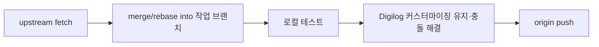

# Paperclip 소스 베이스 (Digilog Labs)

원천(upstream)과 Digilog Labs fork 저장소의 관계, 동기화 방식, 커스터마이징·푸시 정책을 정리한다.

**Fork (origin):** https://github.com/digilog-labs/paperclip  
**Upstream:** https://github.com/paperclipai/paperclip

---

## 1. 목표

| 구분 | 설명 |
|------|------|
| **원천 유지** | [paperclipai/paperclip](https://github.com/paperclipai/paperclip) 업데이트를 끊지 않고 주기적으로 반영 |
| **독립 배포** | 커스터마이징한 결과는 Digilog Labs **자체 GitHub repo**에 push |
| **라이선스 준수** | MIT — 수정·배포 가능, 저작권 고지 유지 |
| **충돌 최소화** | upstream과 fork의 역할을 remote·브랜치·디렉터리로 분리 |

---

## 2. 저장소 역할

```
paperclipai/paperclip  (upstream, 읽기·동기화)
         │
         │  fetch / merge (또는 rebase)
         ▼
  로컬 working tree  (동기화 + Digilog 커스터마이징)
         │
         │  push
         ▼
  digilog-labs/paperclip  (origin, 쓰기·배포)
```

| Remote 이름 | URL (예시) | 용도 |
|-------------|------------|------|
| `upstream` | `https://github.com/paperclipai/paperclip.git` | 공식 릴리스·보안 패치·기능 반영 (pull only 권장) |
| `origin` | `https://github.com/digilog-labs/paperclip.git` | Digilog Labs fork (push 대상) |

**원칙:** `upstream`에는 push하지 않는다. 공헌은 upstream 쪽 PR 정책을 따르고, 일상 개발·배포는 `origin`만 사용한다.

**로컬 remote (구현 완료):**

```text
origin    https://github.com/digilog-labs/paperclip.git
upstream  https://github.com/paperclipai/paperclip.git
```

---

## 3. MIT 라이선스와 커스터마이징

- 원본: 루트 `LICENSE` — Copyright (c) 2025 Paperclip AI, MIT.
- **허용:** 사용, 복제, 수정, 병합, 배포, 서브라이선스, 판매 (고지문 유지 조건).
- **의무:** 소프트웨어 및 “substantial portions”에 **원저작권 고지 + MIT 허가문** 포함.

### Digilog Labs 쪽 권장 관행

1. **원본 LICENSE 파일은 삭제·대체하지 않는다.** (필요 시 `NOTICE` 또는 README에 Digilog 변경 요약 추가.)
2. **대규모 수정·추가 모듈**이 있으면 해당 파일/패키지에 SPDX 또는 짧은 저작권 줄을 유지한다.
3. **상표:** “Paperclip” 등 upstream 브랜드명은 제품 표기 정책에 맞게 사용 (코드베이스 rename은 별도 결정).

커스터마이징 범위 예시 (구현 시 확정):

- `docs/digiloglabs/` — 운영·포크 전용 문서 (upstream PR에 넣지 않을 내용)
- 회사/인스턴스별 설정, 어댑터 플러그인, QoL 패치
- 배포·포트·환경 변수 등 Digilog 인프라에 맞는 변경

upstream에 기여할 만한 범용 수정은 가능하면 **upstream PR**로 분리하고, fork에는 merge만 받는 편이 동기화 비용이 낮다.

---

## 4. 초기 설정 (완료)

1. GitHub Fork: `paperclipai/paperclip` → **`digilog-labs/paperclip`** (`gh repo fork ... --org digilog-labs`)
2. 로컬 remote (`d:\workspace\ws_ai\paperclip`):
   ```bash
   git remote rename origin upstream
   git remote add origin https://github.com/digilog-labs/paperclip.git
   git remote -v
   ```
3. 기본 브랜치: **`master`** (upstream과 동일). 첫 push:
   ```bash
   git push -u origin master
   ```
4. 추적 브랜치: `master` → `origin/master`

---

## 5. 업스트림 동기화 흐름

upstream을 끊지 않고 최신을 받은 뒤, Digilog 커스터마이징과 합치고 `origin`에 push한다.



### 권장 명령 (참고)

```bash
git fetch upstream
git checkout master          # 또는 digilog 기본 브랜치
git merge upstream/master    # 또는: git rebase upstream/master
# 충돌 해결 → pnpm test 등 검증
git push origin master
```

### 동기화 주기·트리거

- upstream **stable tag / release** 노트 확인 후 반영
- 보안 advisory·핫픽스는 우선 동기화
- 대형 리팩터 전에는 `docs/digiloglabs/`에 “동기화 전 커스텀 diff 요약”을 남기면 충돌 해결에 유리

### merge vs rebase

| 방식 | 장점 | 단점 |
|------|------|------|
| **merge** | 히스토리 보존, 팀에게 익숙 | merge commit 증가 |
| **rebase** | 선형 히스토리 | 이미 push한 공유 브랜치에서 위험 |

**권장:** `master`(또는 `digilog/main`)는 **upstream merge**로 동기화하고, 기능 개발은 `feat/*` 브랜치에서 rebase 후 `origin`에 PR/merge.

---

## 6. 브랜치 전략 (안)

| 브랜치 | 설명 |
|--------|------|
| `master` (또는 `main`) | upstream 동기화 + Digilog 안정 배포선 |
| `feat/*`, `fix/*` | 커스터마이징·실험 (origin에 push) |
| (선택) `upstream-sync-*` | 대규모 upstream 병합 전용, 검증 후 master에 merge |

upstream의 수많은 `remotes/origin/PAP-*` 브랜치는 **로컬에서 추적하지 않아도 된다.** 필요 시 `upstream`에서 특정 브랜치만 fetch.

---

## 7. 커스터마이징과 충돌 관리

1. **가능한 한 경계를 나눈다** — 예: Digilog 전용은 `docs/digiloglabs/`, 플러그인은 외부 패키지·`~/.paperclip/` 설정.
2. **코어 패치**는 파일 단위로 최소화하고, upstream에 올릴 수 있으면 upstream PR로 분리.
3. 동기화 후 **반드시** 관련 검증 실행 (repo 기본: `pnpm test`, hand-off 시 `pnpm -r typecheck`, `pnpm test:run`, `pnpm build` — `AGENTS.md` 참고).
4. 반복 충돌 파일은 `docs/digiloglabs/`에 “유지보수 노트”로 기록 (구현 후).

---

## 8. Push / 배포

- **일상 push 대상:** `origin` (= Digilog fork)만.
- **CI/CD·이미지·npm**은 fork repo 기준으로 연결 (구현 단계에서 workflow·secrets 정의).
- upstream에 역방향 push하지 않음 (공식 기여는 fork → upstream PR).

---

## 9. 디렉터리·문서

| 경로 | 역할 |
|------|------|
| `doc/`, `AGENTS.md`, `doc/SPEC-implementation.md` | upstream과 공유하는 제품·개발 계약 (동기화 시 diff 주의) |
| `docs/digiloglabs/` | **Digilog 전용** — fork 운영, source_base, 배포·동기화 노트 |
| `data/`, `.env` | 로컬/비밀 — git에 포함하지 않음 |

---

## 10. 체크리스트

- [x] GitHub fork: `digilog-labs/paperclip`
- [x] `git remote`: `upstream` + `origin` 분리
- [x] 첫 `git push -u origin master` (Digilog 문서 커밋 포함)
- [ ] MIT 고지 유지 방침 팀 합의 (정책 문서화)
- [ ] upstream 동기화 주기·담당자 지정
- [ ] Digilog 전용 변경 목록 초안 (추가 문서)

---

## 11. 참고 링크

- Upstream: https://github.com/paperclipai/paperclip  
- License: https://github.com/paperclipai/paperclip/blob/master/LICENSE  
- 로컬 개발: 루트 `AGENTS.md`, `doc/DEVELOPING.md`

---

## 변경 이력

| 날짜 | 내용 |
|------|------|
| 2026-05-18 | 초안 — fork·upstream 동기화·MIT·push 구조 정리 |
| 2026-05-18 | 구현 — `digilog-labs/paperclip` fork, remote 분리, `docs/digiloglabs/` 커밋 |
